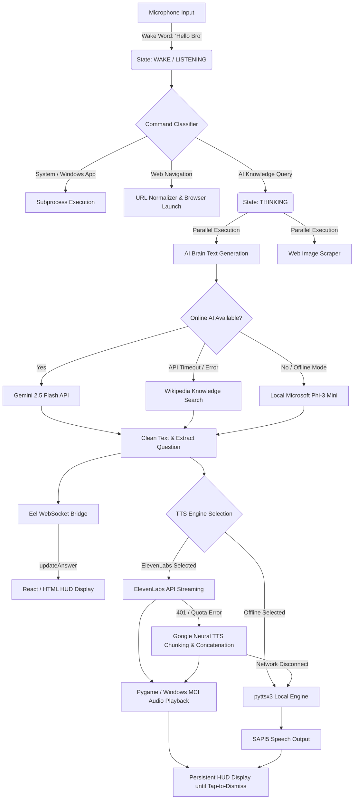

# 🌌 Vc Soul — S.O.U.L. Voice Assistant (v0.2)

**S.O.U.L.** (System of Universal Listening) is a state-of-the-art, voice-activated AI assistant featuring a premium glassmorphic Web HUD interface (React/Vite + Eel) powered by an advanced multi-threaded Python core. Designed for high-fidelity speech synthesis, dynamic visual feedback, and robust offline fallbacks.

---

## 🚀 Key Innovations & Features

### 🎙️ 1. Commercial-Grade Multi-Voice Speech Engine
- **Multi-Voice Selector:** Instantly switch between 5 premium voice profiles directly from the HUD settings:
  - 🖥️ **Windows Offline (Local Fallback)** — Standard local voice.
  - 👩‍💼 **ElevenLabs: Aria (Calm & Professional)** — `2zRM7PkgwBPiau2jvVXc`
  - 🕴️ **ElevenLabs: Marcus (Deep & Commanding)** — `2BsEFcU7jUhLaUwV4h7l`
  - 👱‍♀️ **ElevenLabs: Sarah (Warm & Conversational)** — `DKSYnVsGaIwlOF31S3sV`
  - 👨‍⚖️ **ElevenLabs: David (Crisp & Authoritative)** — `4O1sYUnmtThcBoSBrri7`
- **Custom API Key Input:** Secure password input box in settings to paste your own ElevenLabs API key for ultra-realistic speech streaming.
- **Smart Free Neural Fallback (Zero Key Needed):** If an ElevenLabs key is missing, invalid (`401 Unauthorized`), or quota exceeded, S.O.U.L. instantly falls back to studio-quality **Google Neural AI Speech**. Uses `textwrap` chunking and binary stream concatenation to read full multi-paragraph explanations flawlessly without hitting API character limits.
- **Native MP3 Playback Bridge:** Dual-layer audio playback using `pygame.mixer` (with explicit buffer/frequency tuning) or native Windows MCI (`mciSendStringW`) for bulletproof background audio streaming.

### 🖥️ 2. Persistent HUD Question & Answer Display
- **Dedicated Question Banner:** Displays your exact voice query in a bold, glowing cyan glassmorphic banner directly above the AI's explanation for crystal-clear visual confirmation.
- **Persistent AI Explanations:** Explanations remain beautifully displayed on the HUD indefinitely until you manually tap the screen or click the dismiss hint (`✖ TAP ANYWHERE TO DISMISS`).
- **Parallel Image Fetching:** Simultaneously scrapes and displays relevant scientific, historical, or contextual images alongside the AI text.

### 🌤️ 3. High-Precision Weather & Geolocation Engine
- **Professional Meteorology API:** Powered by the commercial-grade Open-Meteo API, matching professional radar networks for real-time accuracy.
- **Dual-Layer Geolocation:** Combines IP geolocation fallback (`ip-api.com`) with precise GPS coordinates to deliver live local weather (temperature, conditions, day/night iconography) directly to the bottom-left HUD widget.

### ⚙️ 4. Interactive Settings & UI Personalization Suite
- **Interactive Settings Modal:** Accessible via the top-left glassmorphic button (`⚙️`) for real-time system configuration.
- **Dynamic Theme Control:** Interacts with Vanta.js 3D background animations to instantly swap between 4 curated color palettes: Neon Violet (Default), Cyber Cyan, Emerald AI, and Crimson Core.
- **Light/Dark Mode:** Comprehensive styling suite that re-themes glassmorphism panels, typography, and background canvas on the fly.
- **System Controls:** Toggle Wake Word listening (`ACTIVE` / `MUTED`), switch AI Intelligence Modes (Hybrid vs. Offline Phi-3), and open live system logs (`soul.log`).

---

## 🧠 Architectural Flow & Working Process

S.O.U.L. operates on a highly optimized, asynchronous multi-threaded architecture designed to prevent UI freezing and ensure instantaneous voice responsiveness.



---

## 🛠️ Implementation Step-by-Step Process

### Step 1: Environment & Core Initialization
1. **Audio & STDOUT Teeing:** Initializes `sys.stdout` and `sys.stderr` through a custom `Tee` class to simultaneously log all system events to `soul.log` while preventing `pythonw.exe` crashes when launched via Windows desktop shortcuts.
2. **Library Validation:** Dynamically verifies the availability of `requests`, `google.generativeai`, `transformers` (Phi-3), and `pygame`. Sets appropriate global availability flags (`ONLINE_AI_AVAILABLE`, `PYGAME_AVAILABLE`).

### Step 2: Background Listening Loop (`_start_worker`)
1. **Microphone Calibration:** Adjusts `speech_recognition` energy thresholds dynamically to filter out ambient background noise.
2. **Passive Listening:** Continuously listens in a background thread for the wake words (`"hello bro"`, `"hi bro"`, `"hey bro"`, `"bro"`).
3. **State Transition:** Upon wake word detection, triggers `_activate()`, plays the Windows `SystemHand` chime, updates the HUD to `LISTENING`, and sets the `_mic_event` flag to capture the active command.

### Step 3: Command Routing & Parallel AI Processing (`handle_command`)
1. **Local App & Web Routing:** Instantly intercepts operating system commands (e.g., `open calculator`, `launch notepad`) and web navigation requests (`open netflix`), executing them via asynchronous `subprocess` calls.
2. **AI Trigger Detection:** For knowledge queries (`what`, `who`, `why`, `where`, `how`, `tell`, `explain`), updates HUD state to `THINKING`.
3. **Parallel Queueing:** Spawns two concurrent daemon threads:
   - **Thread 1 (`fetch_ai`):** Calls `SoulAIBrain.generate()` to generate a thorough conversational explanation.
   - **Thread 2 (`fetch_imgs`):** Scrapes high-quality contextual images related to the query entity.

### Step 4: AI Brain Generation Hierarchy (`SoulAIBrain.generate`)
1. **Tier 1 (Gemini 2.5 Flash):** Injects real-time date/time context into the system prompt and requests a comprehensive, engaging explanation.
2. **Tier 2 (Wikipedia Fallback):** If Gemini times out or is restricted, falls back to the Wikipedia API, extracting clean introductory summaries.
3. **Tier 3 (Local Phi-3 Mini):** If offline or explicitly set to Offline Mode, loads `microsoft/Phi-3-mini-4k-instruct` via HuggingFace `transformers` pipeline for 100% local text generation.

### Step 5: Web HUD Synchronization (`eel.updateAnswer`)
1. **WebSocket Transmission:** Sends the extracted answer, scraped image URLs, and capitalized user question across the Eel WebSocket bridge to `script.js`.
2. **DOM Manipulation:** Hides the S.O.U.L. orb, reveals `#ai-response-container`, populates `#ai-question-text` banner, displays the explanation in `#ai-text`, and creates an image grid in `#ai-images`.
3. **Tap-to-Dismiss Binding:** Keeps the container visible indefinitely until the user clicks or taps anywhere on the HUD, triggering `dismissAnswer()` and `eel.manual_deactivate()`.

### Step 6: Multi-Voice Speech Synthesis (`_tts_worker`)
1. **Sanitization (`clean_for_speech`):** Uses regex stripping to remove markdown bolding (`**`), headers (`#`), brackets, and emojis from the AI text to prevent Windows SAPI5 crashes.
2. **ElevenLabs Streaming:** If an ElevenLabs voice is selected and an API key is present, makes a `POST` request to ElevenLabs API to fetch high-fidelity MP3 binary streams.
3. **Google Neural Fallback:** If ElevenLabs fails (e.g. no key or `401`), uses `textwrap.wrap()` to slice the text into 180-character chunks, fetches Google Neural TTS audio for each chunk, and concatenates the binary streams into a complete master audio file.
4. **Bulletproof Audio Playback:** Saves the combined stream to `temp_speech.mp3` and plays it via `pygame.mixer` or native Windows MCI (`mciSendStringW`). If MP3 streaming encounters any OS errors, instantly falls back to `pyttsx3` offline speech.

---

## 📂 Project Structure

```
Vc_Soul-0.2/
├── src/                        # React frontend (Vite)
│   ├── App.jsx                 # Main dashboard UI
│   └── index.css               # Global styles
├── public/
│   └── expose.js               # JS ↔ Python bridge
├── Vc-Soul-Voice-Search/       # Python backend (Eel)
│   ├── ultimate_voice_search.py  # Main assistant core & AI Brain
│   ├── web/                    # Eel HTML HUD interface
│   │   ├── index.html          # HUD Layout & Settings Modal
│   │   ├── script.js           # DOM manipulation & WebSocket bridge
│   │   └── style.css           # Glassmorphism & Light/Dark themes
│   ├── install.bat             # Windows dependency installer
│   ├── install.sh              # Linux/Mac installer
│   └── requirements_ai.txt     # Python dependencies
├── index.html                  # Vite entry
├── package.json                # Node dependencies
└── README.md                   # Complete architectural documentation
```

---

## ⚙️ Setup & Installation

### 1. Python Backend (Eel HUD)
```bash
cd Vc-Soul-Voice-Search
pip install -r requirements_ai.txt
python ultimate_voice_search.py
```

### 2. React Dev Server (Optional)
```bash
npm install
npm run dev
```

---

## 🗣️ Voice Command Reference

| Command Trigger | Action Performed | System State / Output |
| :--- | :--- | :--- |
| `Hello Bro` / `Hey Bro` | Wakes up assistant from idle sleep | Plays chime, HUD switches to `LISTENING` |
| `Open Netflix` / `Launch Chrome` | Opens native Windows app or website | Asynchronous subprocess execution |
| `Search Python tutorial` | Opens default browser to Google search | Direct URL navigation |
| `YouTube lo-fi music` | Opens YouTube search results | Direct URL navigation |
| `Explain quantum physics` | Triggers AI Brain knowledge generation | Displays Question banner, AI text, Images & Voice Over |
| `Tell me a joke` | Fetches conversational response | Displays AI text & Voice Over |
| `What time is it` | Calculates live local time | Voice Over response |
| `Goodbye` / `Rest` | Puts assistant back to passive sleep | HUD switches to `IDLE`, waiting for wake word |

---

*Engineered with absolute passion and precision for S.O.U.L. v0.2.* 🌌
